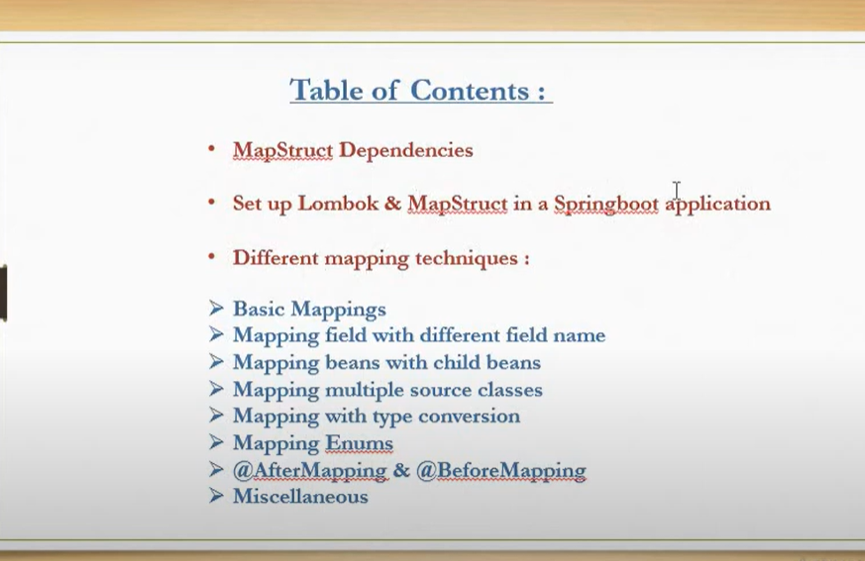

Streams concept is related to Lambda expressions & collections.

Collections -> represents a group of objects.

Lambda expressions -> to provide functional programming features inside the OOPS of java.

Streams: To process/Transform the elements from the collection we use Streams.

Transform methods:
- filter
- map
- collect
- sorted
- distinct

Transforming process:

- From collection, all the elements will be put into the streams and Now the transform function is applied on each element inside the stream.
  here actual data inside the collections won't be change, instead data inside streams gets change and collected finally into a list.

  

MapStruct:
- For mapping DTO to Entity & Entity to Dto
  

3 deps:
 	<dependency>
			<groupId>org.mapstruct</groupId>
			<artifactId>mapstruct</artifactId>
			<version>1.5.5.Final</version>
		</dependency>
		<dependency>
			<groupId>org.mapstruct</groupId>
			<artifactId>mapstruct-processor</artifactId>
			<version>1.5.5.Final</version>
		</dependency>

2). 
    - Basic mappings.

    @Mapper(componentModel ="spring")
    - we use componentModel to inject the mapper interface in other classes for object creation.